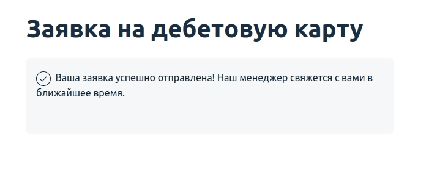
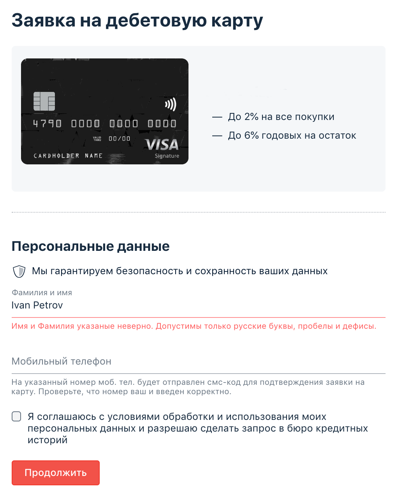

## Задача №1: заказ карты ##
Вам необходимо автоматизировать тестирование формы заказа карты:

Требования к содержимому полей:

1. В поле фамилии и имени разрешены только русские буквы, дефисы и пробелы.
2. В поле телефона — только 11 цифр, символ + на первом месте.
3. Флажок согласия должен быть выставлен.
Тестируемая функциональность: отправка формы.

Условия: если все поля заполнены корректно, то вы получаете сообщение об успешно отправленной заявке:

## Задача №2: проверка валидации (необязательная) ##
После того как вы протестировали happy path, необходимо протестировать остальные варианты.

Тестируемая функциональность: валидация полей перед отправкой.

Условия: если какое-то поле не заполнено или заполнено неверно, то при нажатии на кнопку «Продолжить» должны появляться сообщения об ошибке. Будет подсвечено только первое неправильно заполненное поле:

